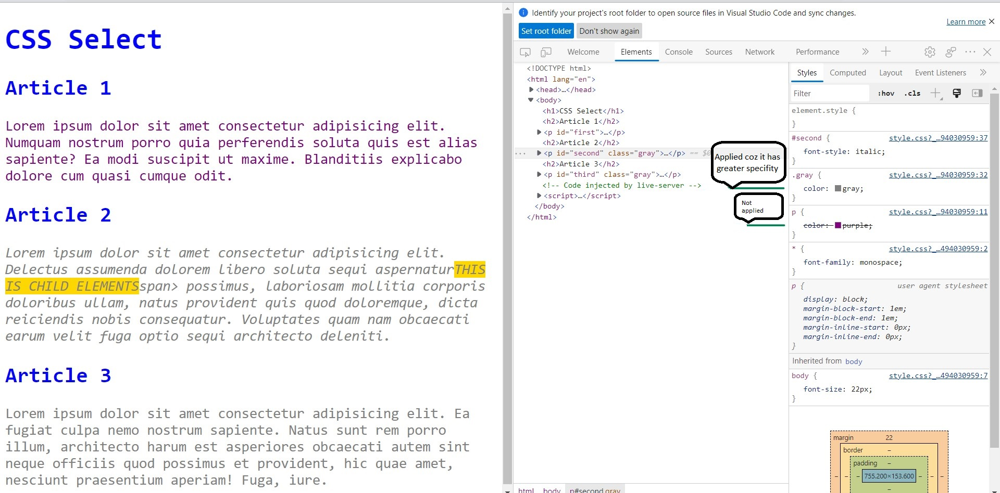
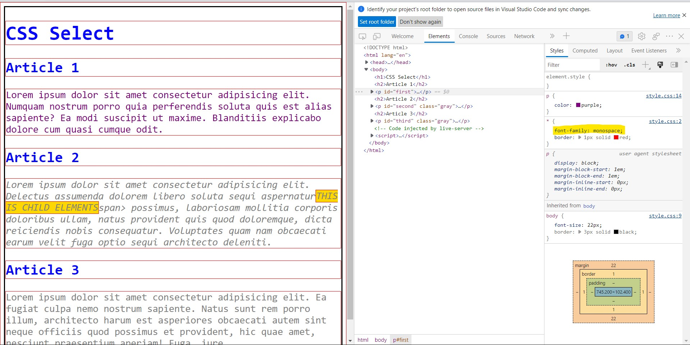

# <center>Unit 2 - CSS Selector</center>

CSS Selectors - CSS selectors define the elements to which a set of rules apply.\

Types of selectors -:

1. Universal selector - **Selects all elements**.\
Syntax: `* ns|*` `*|*`\
Example: 
```css
*{
    margin : 0px;
}
```

2. Elements selectors -: Select element using HTML tags.\
Syntax : `tagName{...}`\
Example :  
```css
p{
    color : gray;
}
```
3. Class selector -: Select all elements of a class. Syntax : `.className{...} `\
Example -:
```css
.gray{
    color : gray;
}
```
4. Id selector -: Select a specific elements only based on their HTML id we rarely use this coz id's are unique. Syntax : `#id{...}`.\
Example :
```css
#second{
    font-style : italic;
}
```
5. Group selector -: 
   1. List Combinator -  We can apply same property to many selector just by grouping them as one selector using `,`. syntax -: `h1, h2{...}`.\
        Example -:
        ```css
        h1, h2{
            color : blue;
        }
        ```
        if we omit the `,` then it will interpret as `h2` tag in `h1`. its called **Descendant Combinator**.

    2. Descendant Selector - The `" "`(space) selects element that are descendants of first element. Syntax -: `h1 h2{...}`.\
    Example -:

        ```css
        h1 h2{
            color : red;
        } 
        ```
    3. Child selector - The `>` sign selects direct children of first element. syntax `tag > child_tag{...}`.\
    Example :

        ```css
        h1 > h2{
            background : black;
            color : white;
        }
        ```
    4. General sibling - The `~` sign selects siblings(selects the element that shares same parent), Syntax : `A ~ B{...}`.\
    Example -: 

        ```css
        h2 ~ h2{
            color : pink;
        }
        ```
    
    5. Adjacent sibling : The `+` sign matches the second element only if it immediately follows the first element.\
    Syntax: `A + B{...}`.\
    Example -: 

        ```css 
        h2 + p{
            /* will match the first <p> element that immediately follow an <h2> element. */
            font-size : 17px;
        } 
        ```

    6. Column selector - The `||` sign selects elements which belong to a column. Syntax: `A || B{...}`.\
    Example -:

        ```css
        col || td {
            /* will match all <td> elements that belong to the scope of the <col>. */
            margin : 5px;
        }
        ```
    There are also some pseudo selectors.
    
## **Specificity**

CSS(Cascading style sheet) its work like a waterfall.\
it apply properties from top to bottom. So, the ruleset that defined at last will be applied. But specificity can overwrite this.\
 Order of specificity :-
```
universal selector[*] < body[body] <Elements selector[<>] < class[.] < id[#] 
```

~~~
We can surpass all the specificity by using `!important` with a property
Example -:
    p{ color : pink!important; }
~~~




## **Inheritance**

In CSS, **inheritance** controls what happens when no value is specified for a property on an element.\
**Note:**`<form>...</form>` elements don't get properties by default we can specify by using `selector{properties : inherit;}`

The CSS properties is divided into two types -:\
- **Inherited Properties** -: Those properties which is by default are set to the element based on their parents([computed value](https://developer.mozilla.org/en-US/docs/Web/CSS/computed_value)).\
Example -:

    ```css
    p{
        color : green;
    }
    /* this property will apply to all child element of this p tag*/
    ```

- **Non-inherited properties** -: Those properties which is by default are set to the element based on initial value or those properties.\
Only root elements of document gets the [initial](https://developer.mozilla.org/en-US/docs/Web/CSS/initial_value) values.



To see specificity you can use [specificity calculator](https://specificity.keegan.st/).

List of inherited and non-inherited properties -:

* **Inherited** -:
   - Font Type : `font-style`, `font-variant`, `font-weight`, `font-stretch`, `font-size`, `font-family`, `color`, `line-height;`
   - Space Type: `letter-spacing`, `word-spacing`, `white-space;`
   - Letter Type: `text-align`, `text-indent`, `text-shadow`, `text-transform;`
   - List Type: `list-style`, `list-style-type`, `list-style-position;`
   - Others: `visibility`, `cursor;`

* **Non-Inherited Type** -:
    - Layout Type: `float`, `position`, `left`, `right`, `top`, `bottom`, `z-index`, `display;`
    - Box Type: `width`, `max-width`, `min-width`, `height`, `max-height`, `min-height`, `margin`, `padding`, `border;`
    - Background Type: `background-size`, `background-image`, `background-clip`, `background-color`, `background-origin`, `background-position`, `background-repeat;`
    - Others: `overflow`, `text-overflow`, `vertical-align;`
